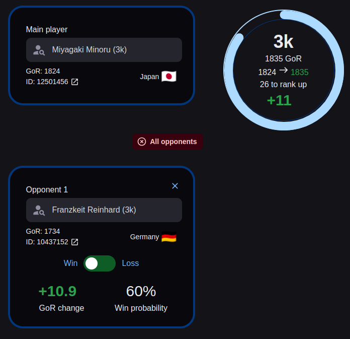

<p align="center">
    
</p>

## [🚀️ gor-calculator.com](https://gor-calculator.com/)

## [📜️ Article on my web](https://radim.xyz/project/gor-calculator/)

```bash
npm install
npm run dev
# or for testing with local storage
npm run build && npm run start
```

---

Possible TODO:

- page for donations
  - cool blinking css link https://freefrontend.com/css-glow-effects/
- background light and dark
  - GlobalStyles
    https://mui.com/material-ui/customization/how-to-customize/#4-global-css-override
  - set background viz sign-in-slide
    https://mui.com/joy-ui/getting-started/templates/
- add favorites page
  - list of favored players stored locally
  - possible click and use as a main player or opponent
- add a details expand for opponents
  - show how many points they would gain/loose
